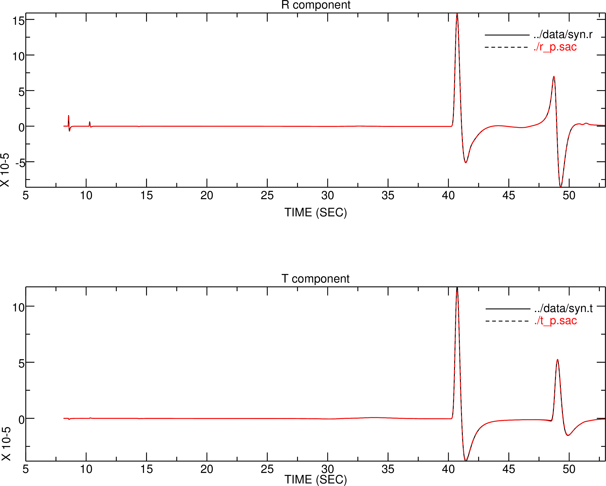
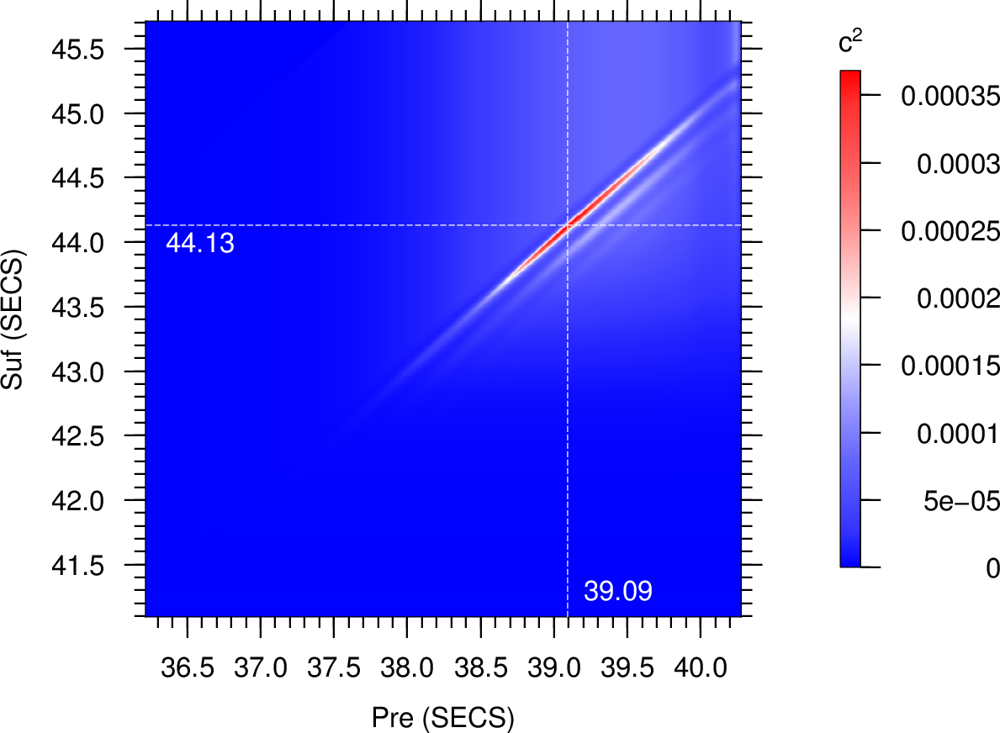
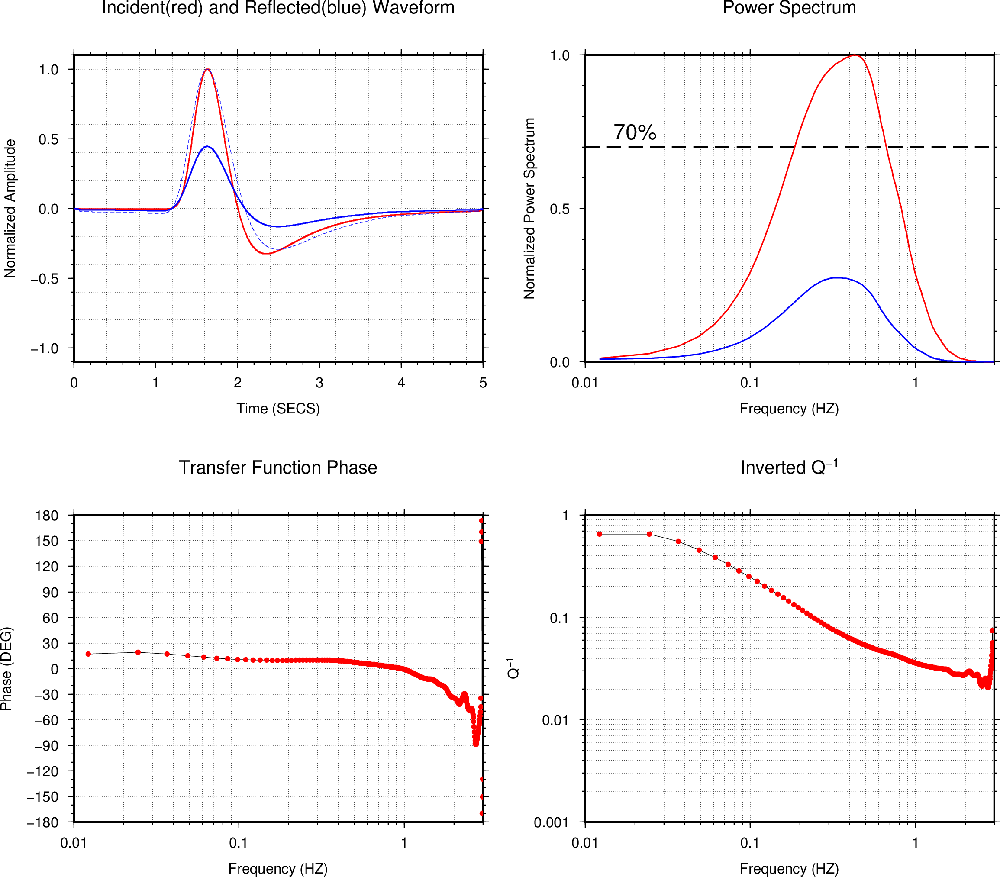

# Qinv

This is a package for attenuation analysis for borehole observation.

Author: Sheng Wang
Email: wangsheng.cas(at)gmail.com

# 1. Prerequest

[`fftw3`](http://www.fftw.org/) is required for this package.

# 2. How to install

```
make
make install
```

# 3. Tools

## Binary

- `polarizeP`: invert the Back-Azimuth given NEZ components, and rotate to radial and the tangential directions.
- `findBestWin`: find the best time window, and lag time for the incident and the surface reflected phases.
- `qinv`: invert the Q value given tangential trace, and the time windows of the incident and the reflected phases.
- `stackQ`: stack the inverted Q values in a single station to get a stable value.

## Script for volume production

- `findBestWinSet.py`: volume production for `findBestWin`.
- `qinvSet.py`: volume production for `qinv`.
- `stackQ.py`: volume production for `stackQ`.

## Binary tests

All binaries of `test_...` are for checking whether this package is correctly installed.

- `test_atten`: 
- `test_crossSpec`: 
- `test_findBestWin`: 
- `test_polarize`: 
- `test_qinv`: 
- `test_qjob`: 
- `test_ranStack`: 
- `test_stackQ`: 
- `test_tracef1d`: 
- `test_tracef1d_Spec`: 
- `test_winopt`: 

# 4. Example

Examples are presented in the directory of `exam/`, and please find the script examples of `run.sh` in each subdirectories.

# 4.1 `exam_polarize_syn/`

Polarization example for synthetic seismograms.




Fig 4.1 Comparison of the radial and tangential synthetic seismograms (black lines), and the inverted seismograms(red lines) from `polarizeP`. 

------


# 4.2 `exam_findBestWin_syn/`

Find the optimal time windows of the incident and the surface reflected phases in synthetic borehole seismogram.



Fig .2 Grid search isogram for the optimal windows of the incident and the surface reflected phases for synthetic tangential component. Waveform comparison is presented in Fig 4.3.

------


# 4.3 `exam_qinv_syn/`

Invert the Q value given the incident and the surface reflected traces.



Fig 4.3 (up-left):The comparison of incident and the surface reflected phases. (up-right):The power spectrum comparison, black dash line presents the level of 70% maximum power. (low-left): The phase of the transfer function. (low-right): The inverted Q value. Please note that Q value is valid for the frequency band of (0.2, 0.6)Hz , in which the signal power is strong, and the phase of the transfer function is stable and approximates 0 degree.